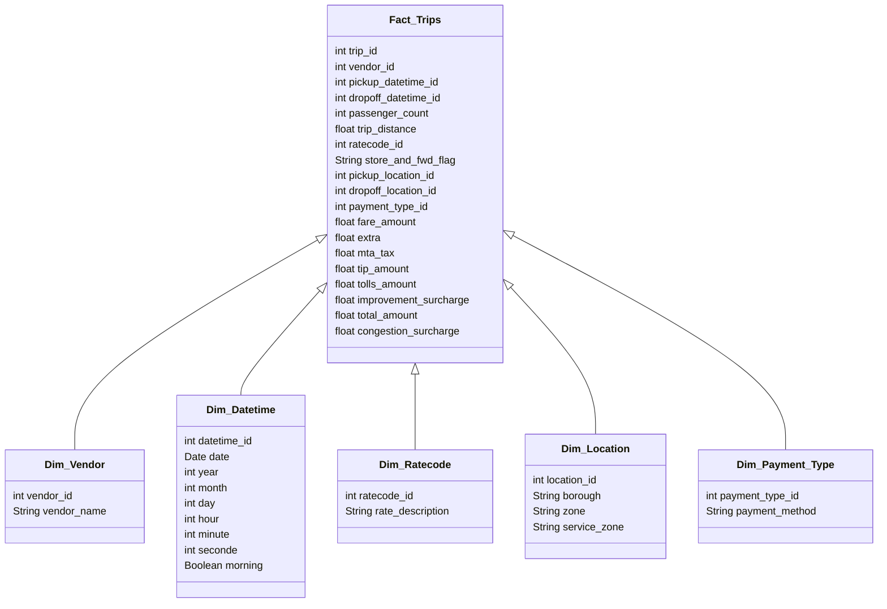

```mermaid
classDiagram
    Fact_Trips <|-- Dim_Vendor
    Fact_Trips <|-- Dim_Datetime
    Fact_Trips <|-- Dim_Ratecode
    Fact_Trips <|-- Dim_Location
    Fact_Trips <|-- Dim_Payment_Type

    class Fact_Trips {
        int trip_id
        int vendor_id
        int pickup_datetime_id
        int dropoff_datetime_id
        int passenger_count
        float trip_distance
        int ratecode_id
        String store_and_fwd_flag
        int pickup_location_id
        int dropoff_location_id
        int payment_type_id
        float fare_amount
        float extra
        float mta_tax
        float tip_amount
        float tolls_amount
        float improvement_surcharge
        float total_amount
        float congestion_surcharge
    }

    class Dim_Vendor {
        int vendor_id
        String vendor_name
    }

    class Dim_Datetime {
        int datetime_id
        Date date
        int year
        int month
        int day
        int hour
        int minute
        int seconde
        Boolean morning
    }

    class Dim_Ratecode {
        int ratecode_id
        String rate_description
    }

    class Dim_Location {
        int location_id
        String borough
        String zone
        String service_zone
    }

    class Dim_Payment_Type {
        int payment_type_id
        String payment_method
    }

```