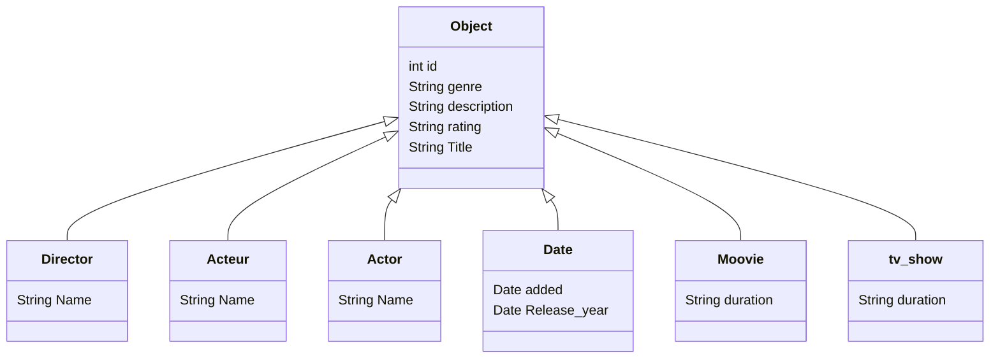

```mermaid
classDiagram
    Object <|-- Director
    Object <|-- Acteur
    Object <|-- Actor
    Object <|-- Date
    Object <|-- Moovie
    Object <|-- tv_show

    class Director{
        String Name
    }
    class Acteur{
        String Name
    }
    class Object{
        int id
        String genre
        String description
        String rating
        String Title
    }
    class Actor{
        String Name
    }
    class Date{
        Date added
        Date Release_year
    }
    class Moovie{
        String duration
    }
    class tv_show{
        String duration
    }
```